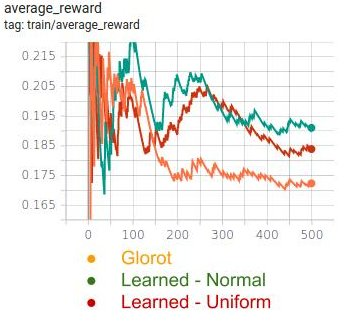
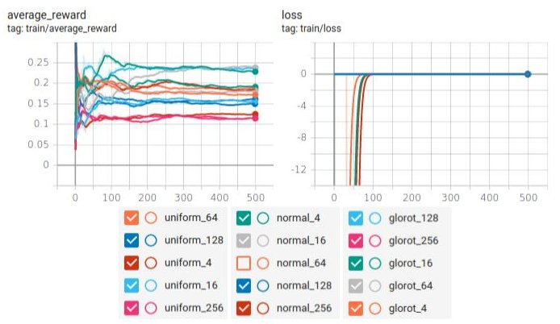

# Learning to Initialize

## About

- `run_mnist.py` to run the experiments on MNIST

## Glorot v/s Learned Initializations (Uniform and Normal) - Results for MNIST

### Average Accuracies of Target models after 4 batches of SGD

### Average Accuracies of Target models after various number of batches

